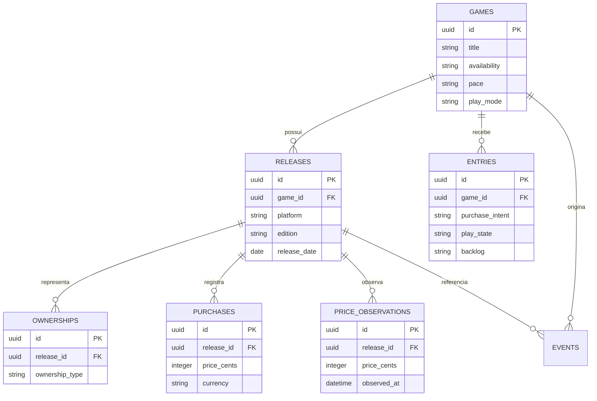

# Dockd

> Biblioteca, backlog e planejador de compras para jogos Nintendo Switch e Switch 2.

[](https://elixir-lang.org/) [](https://www.phoenixframework.org/) [](LICENSE)

Dockd parte de uma ideia simples: o problema não é ter mais uma lista de jogos. É decidir **o que comprar, quando comprar e por quê**. O planejador é o centro do produto; biblioteca e backlog existem para dar contexto financeiro e de calendário a essa decisão. Jogos parados também precisam aparecer como um argumento honesto contra a próxima compra.

## O que é o Dockd

Um projeto pessoal, de escopo deliberadamente Nintendo, para organizar o caminho entre uma obra que interessa e uma compra que faz sentido. O produto não tenta ser rede social, catálogo de avaliações, agregador de notas ou diário de jogo.

A restrição a Switch e Switch 2 é uma escolha de produto, não uma limitação acidental. Ela permite tratar problemas específicos do ecossistema, como exclusivos, jogos físicos com pouca redução de preço, game-key cards e saldo preso no eShop.

## Estado atual

### Disponível hoje

- Cadastro e edição de obras no catálogo, com título, slug, disponibilidade, desenvolvedora, publicadora e capa.
- Etiquetas de catálogo para duração estimada, ritmo e modo de jogo.
- Cadastro e edição das versões de uma obra para Switch ou Switch 2.
- Indicação de disponibilidade física e digital por versão.
- API JSON na aplicação, com operações de consulta e escrita para obras e versões.
- Persistência em PostgreSQL com migração versionada e restrições de unicidade.

A interface atual está concentrada no catálogo. O planejador financeiro, os estados pessoais e a biblioteca ainda estão sendo construídos.

### Planejado

- Home orientada a dinheiro, calendário e próximas decisões de compra.
- Entradas pessoais com intenção de compra, estado de jogo, backlog, prioridade e preferência de mídia.
- Posse independente da intenção, incluindo jogos já adquiridos em outra plataforma como informação de decisão.
- Compras e observações de preço informadas pelo usuário, sempre com data, moeda e origem.
- Log append-only de transições para gerar sinais de tempo sem transformar o sistema em event sourcing.
- Saldo reservado no eShop, veto por versão e sinalização de game-key card.
- Cliente Flutter futuro consumindo a mesma API e a mesma camada de domínio.

## Modelo de domínio

A intenção pertence à obra. A versão é a unidade comprável e concentra plataforma, edição, disponibilidade, compra e preço. Posse e intenção são eixos independentes.



`entries`, `ownerships`, `purchases`, `price_observations` e `events` fazem parte do modelo alvo. No estado atual do código, a migração implementada cobre `games` e `releases`; as demais estruturas serão adicionadas junto às respectivas features.

## Arquitetura e stack

Uma aplicação Phoenix única serve a interface LiveView e a API JSON sobre a mesma camada de domínio. O banco é acessado por Ecto e PostgreSQL; não há um segundo backend para o futuro cliente Flutter.

| Componente | Versão | Papel |
| --- | --- | --- |
| Elixir | `~> 1.17` | Linguagem e runtime da aplicação |
| Phoenix | `1.8.13` | Framework web |
| Phoenix LiveView | `1.2.11` | Interface reativa |
| Ecto | `3.14.2` | Modelo e consultas |
| Ecto SQL | `3.14.0` | Integração SQL e migrações |
| Postgrex | `0.22.4` | Driver PostgreSQL |
| Bandit | `1.12.5` | Servidor HTTP |
| Tailwind | `0.5.1` | Instalador do Tailwind CSS 4 |
| DaisyUI | `v5.5.20` | Componentes visuais sobre Tailwind 4 |

As versões efetivamente resolvidas estão em [`mix.lock`](mix.lock); as restrições de dependência estão em [`mix.exs`](mix.exs).

## Começando

### Pré-requisitos

Para o caminho nativo, instale [mise](https://mise.jdx.dev/), que seleciona as versões definidas em [`.tool-versions`](.tool-versions), e tenha PostgreSQL disponível.

### Configuração local

A forma mais rápida, sem instalar Elixir ou PostgreSQL, é:

```bash
cp .env.example .env
docker compose up --build
```

Abra <http://localhost:4000>. Esse compose cria um PostgreSQL próprio e inicializa o banco junto com a aplicação. Os volumes podem ser removidos com `docker compose down -v`.

No caminho nativo:

```bash
cp .env.example .env
export DOCKD_DB_PASSWORD='sua-senha-local'
mix setup
mix phx.server
```

`mix setup` instala dependências, cria e migra o banco, instala os binários de assets e compila CSS e JavaScript. O [Makefile](Makefile) reúne atalhos para setup, desenvolvimento, testes, lint, formatação, banco e Docker.

Para usar um proxy reverso, copie `.env.example`, preencha `PHX_HOST`, `DATABASE_URL`, `SECRET_KEY_BASE`, `TRAEFIK_NETWORK` e `TRAEFIK_ENTRYPOINT`, e execute `docker compose -f compose.traefik.yml up --build`. Esse compose não cria a rede externa: ela deve existir no ambiente escolhido.

Em produção, `DATABASE_URL` e `SECRET_KEY_BASE` são obrigatórios. `PORT`, `PHX_HOST`, `POOL_SIZE` e `ECTO_IPV6` também são lidos em runtime. Migrações de release podem ser executadas com `bin/migrate` dentro da imagem.

### Testes e validações

```bash
mix test
mix precommit
```

`mix precommit` compila com warnings tratados como erro, verifica formatação, executa Credo em modo estrito e roda os testes.

## Roadmap

1. **Catálogo**: consolidar cadastro de obras e versões Nintendo. *(em andamento)*
2. **Decisão de compra**: adicionar entradas pessoais, preço alvo, observações datadas e compras. *(próximo)*
3. **Planejador**: transformar dinheiro, calendário, backlog e exclusividade em uma visão de decisão. *(planejado)*
4. **Sinais de uso**: registrar transições e usar o histórico para mostrar jogos parados e orientar o próximo jogo. *(planejado)*
5. **Cliente futuro**: estabilizar contratos, testes por rota e especificação OpenAPI antes de um cliente Flutter. *(planejado)*

Coleções, feedback explícito de recomendações e histórico completo de preços por loja estão fora do MVP atual.

## Decisões de produto e engenharia

- **Planejador primeiro**: o backlog alimenta decisões de compra; não é o produto inteiro.
- **Nintendo apenas**: Switch e Switch 2 concentram a complexidade que o Dockd quer resolver.
- **Obra diferente de versão**: vontade pertence ao jogo; posse, preço e compra pertencem à release.
- **Intenção diferente de posse**: querer jogar e já ter acesso são fatos independentes.
- **Estado atual mais log**: a entrada guarda o estado atual; o log append-only fornece sinais temporais. O log não é uma fonte para reconstruir o sistema.
- **Preço é observação**: valores são informados pelo usuário, datados e identificados por origem; nunca são apresentados como atuais sem contexto.
- **Catálogo com fatos**: duração, ritmo e modo de jogo são etiquetas preenchidas no cadastro da obra.
- **Uma aplicação**: Phoenix, LiveView, Ecto e PostgreSQL mantêm interface e API no mesmo domínio.
- **API preparada para o futuro**: a API JSON será consumida por um cliente Flutter, com testes de contrato por rota e OpenAPI gerada a partir do código.

## Licença

O Dockd é distribuído sob a licença [MIT](LICENSE).
